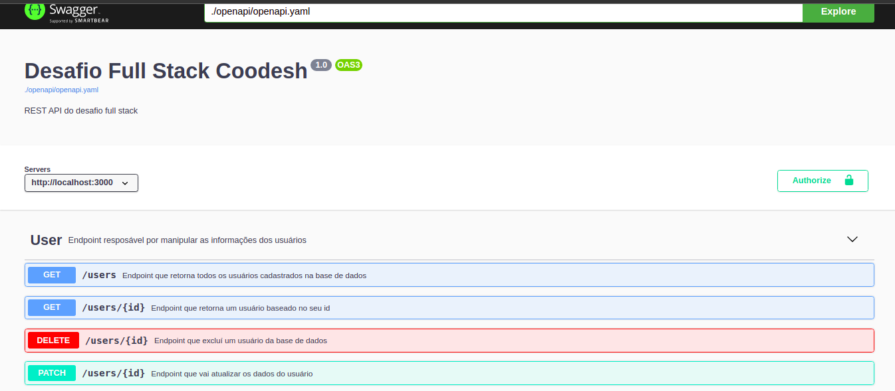

## Fullstack Challenge 20201209

### Introdução
Este é um desafio para testar seus conhecimentos de Full stack;
O objetivo é avaliar a sua forma de estruturação e autonomia em decisões para construir algo escalável utilizando os Frameworks sugeridos na vaga aplicada.

### Case
A empresa Pharma Inc, está trabalhando em um projeto em colaboração com sua base de clientes para facilitar a gestão e visualização da informação dos seus pacientes de maneira simples e objetiva em um Dashboard onde podem listar, filtrar e expandir os dados disponíveis.
O seu objetivo nesse projeto, é trabalhar no desenvolvimento da plataforma da empresa Pharma Inc seguindo os requisitos propostos neste desafio.

## API / Back-End

### Modelo de Dados:
Para a definição do modelo, consultar o arquivo users.json com os campos a serem trabalhados.

- Criar os endpoints:
    - GET /: Retornar uma mensagem "REST Fullstack Challenge 20201209 Running"

    - PUT /users/:userId: Será responsável por receber atualizações realizadas no Projeto Web

    - DELETE /users/:userId: Remover o user da base

    - GET /users/:userId: Obter a informação somente de um user da base de dados

    - GET /users: Listar todos os usuários da base de dados

Integrar a API com o banco de dados solicitado para persistir os dados

## Biblioteca utilizada

 - Ruby on rails

## Iniciando

Caso não possua o ruby instalado em sua máquina acesse este <a href="https://gorails.com/setup/ubuntu/21.04"> link </a> e instale todas dependências para a execução do projeto.

### Clonando o projeto

Digite o comando abaixo para clonar o projeto

    git clone https://github.com/Diogoloiola/desafio-fullstack-backend.git
Agora entre no diretório do projeto.

    cd desafio-fullstack-backend

### Instalando as dependências

Digite o comando abaixo para instalar as dependências do projeto.

    bundle install

### Importando a base de dados

Antes de importar a base de dados precisamos rodar as migrations no projeto, digite o comando abaixo para criar as migrations.

    rails db:migrate

Agora para importar os dados presentes no arquivo .json digite o comando abaixo.

    rails db:seed

### Iniciando o projeto.
Digite o comando abaixo para iniciar o servidor.

    rails s
Agora é só digitar o endereço abaixo no seu navegador, para ver a lista de usuários.

    http://localhost:3000/users

Para realizar as operações de DELETE e PUT é necessário um token de acesso. Como o teste é apenas para fins de entender como o desenvolvedor estrutura um projeto, estou disponibilizando o token de acesso da API.

    e07fbaae3b8242d8986c486d01018ca47b83

## Documentação dos endpoints

Com o objetivo de facilitar o entendimento da API, foi utilizado o swagger para a documentação. Para acessar a documentação entre na pasta docs que está na raiz do projeto e inicie qualquer servidor ou utilize a extensão live server do próprio Visual Studio Code.

### Servidor com php

    php -S localhost:8000

## Créditos
Esse é um desafio da <a href="https://coodesh.com/">coodesh</a>, todos os direitos reservados a empresa.